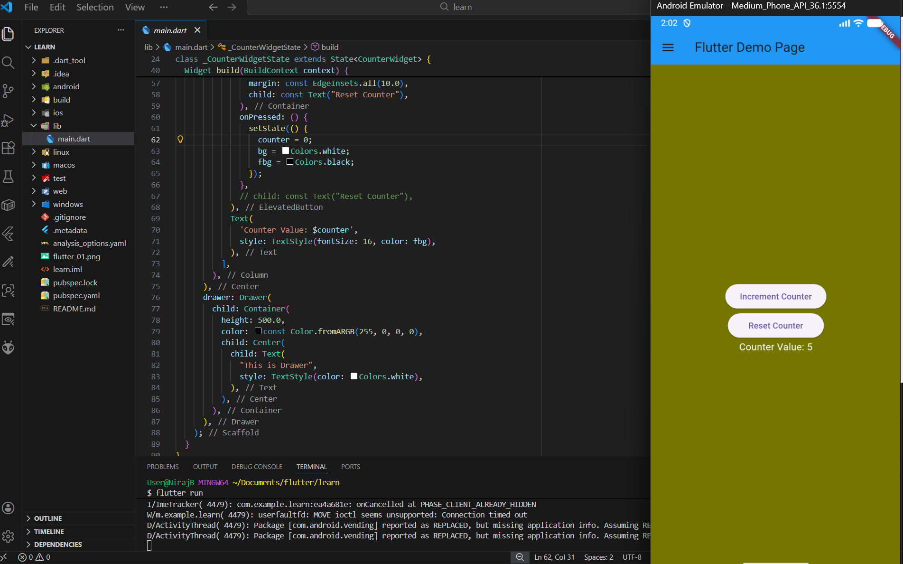
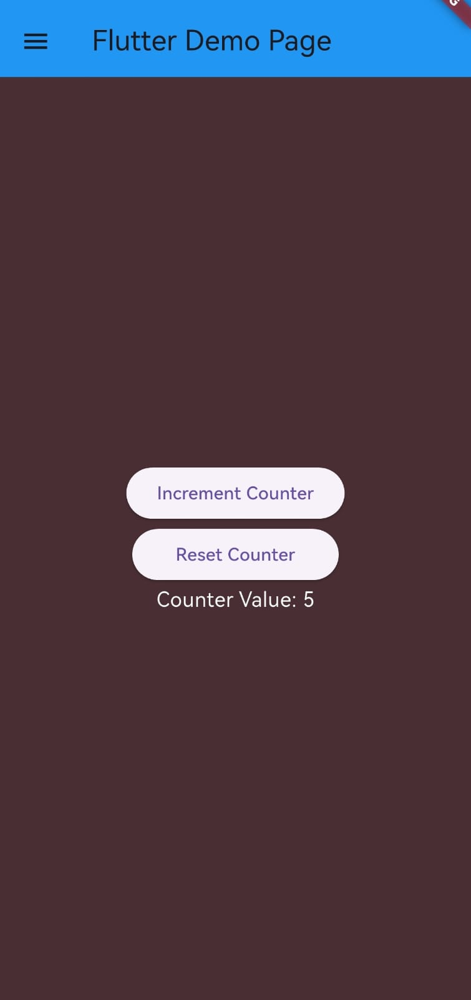

# 🚀 Flutter Learning Challenge

## Day 1 of 15 – Flutter App Development

This repository documents my journey through a **15-day Flutter learning challenge**, starting with the fundamentals of Flutter app development.

---

## 📌 What I Built (Day 1)

On Day 1, I built a simple Flutter app that includes:

- A counter application
- Increment and reset functionality
- Dynamic background and text color changes
- Basic UI layout using Flutter widgets
- Drawer widgets with custom colors

---

## 🧠 Concepts Learned

- Flutter project structure
- Role of `main.dart`
- Difference between `StatelessWidget` and `StatefulWidget`
- State management using `setState()`
- Core Flutter widgets:
  - `Scaffold`
  - `AppBar`
  - `Column`
  - `Text`
  - `ElevatedButton`
  - `Drawer`
- Running Flutter apps on an Android Emulator

---

## 🛠️ Tools & Technologies

- Flutter
- Dart
- Android Emulator
- Visual Studio Code

---
## 📸 Screenshot




---

## ▶️ How to Run the Project

1. Check Flutter installation:
   ```bash
   flutter doctor
