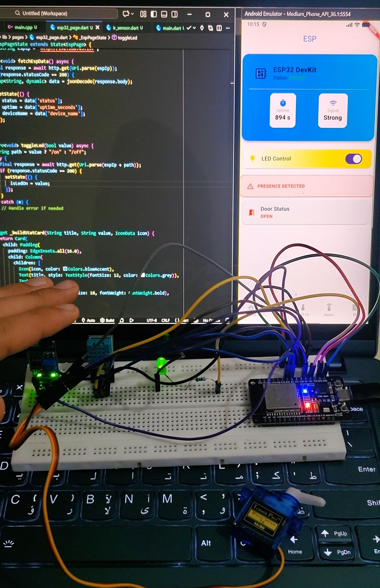
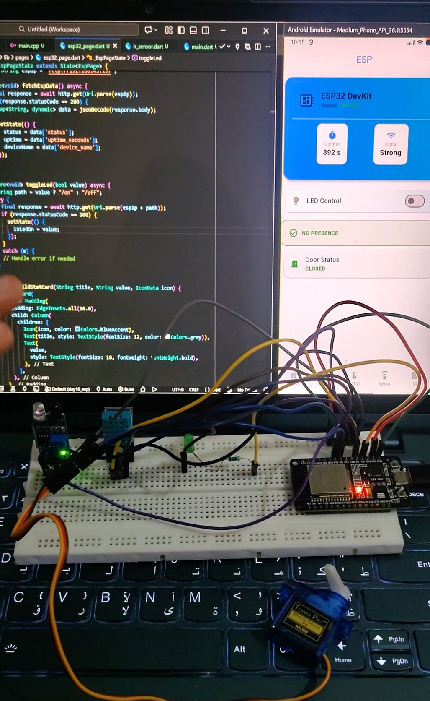
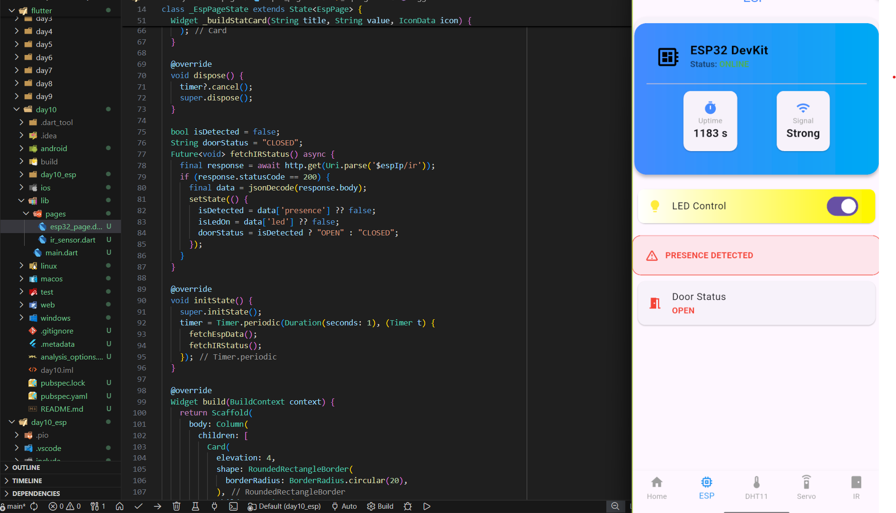

# ⚙️ Flutter Learning Challenge

## Day 10 of 15 – Smart Reflexes & Presence Sensing 👁️⚡

Day 10 focused on giving the project "Sight" and "Autonomy." By integrating an **IR (Infrared) Obstacle Sensor**, the system now reacts instantly to the physical world. I moved away from purely manual commands to **Priority-Based Automation**, where the hardware makes real-time decisions based on human presence and environmental data.

---

## 🚀 What I Built

A **Responsive IoT Dashboard** that:
- **Instant Detection:** Triggers a "Welcome Light" (LED) and opens a "Smart Door" (Servo) the millisecond an object is detected by the IR sensor.
- **Priority Logic:** Implemented a system where Human Detection (IR) takes priority over Climate Control (DHT11) for moving the Servo.
- **Reactive UI:** Developed a "Glow-Effect" dashboard in Flutter where cards visually pulsate and change color when sensors are triggered.
- **Dual-Mode Actuation:** The Servo now functions as both a Security Gate and a Ventilation Window depending on the sensor input.

---

## 🧠 What I Learned

### 🔴 Infrared Sensing & Instant Logic
- **Binary Detection:** Learned that IR sensors provide a digital "Active-Low" signal, offering much faster response times than sound-based sensors for proximity.
- **Sensor Fusion:** Mastered the logic of combining two different inputs (Digital IR + Digital DHT11) to control a single output (Servo) without code conflicts.
- **Threshold Hysteresis:** Learned to manage state switching so the motor doesn't "jitter" when an object is at the edge of the IR range.

### 🎨 Advanced Flutter UI/UX
- **State-Driven Styling:** Used conditional logic in Flutter to change `BoxShadow` and `Icon` states dynamically based on hardware feedback.
- **Implicit Animations:** Implemented `AnimatedContainer` to create smooth visual transitions when the LED turns on/off.
- **Service Decoupling:** Refined the Dart architecture by separating `IoTService` calls from the UI widgets.

---

## 🛠️ Tech Stack
- Framework: Flutter (Dart)
- Hardware: ESP32, SG90 Servo, IR Obstacle Sensor
- Sensor: DHT11 (Climate Data)
- Communication: REST API / Digital Input Polishing
- UI Design: Neumorphic & Animated Containers

---

## 📸 Screenshots

---

