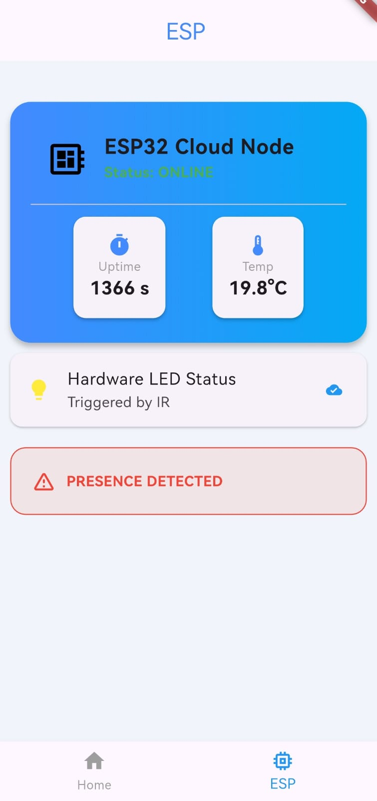
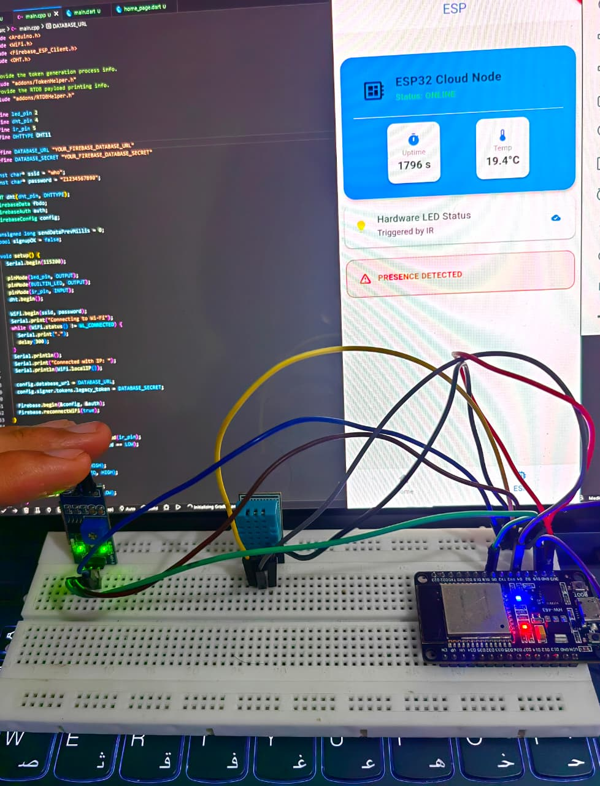

# 🚀 Day 11: ESP32 & Flutter Cloud Integration (Firebase)

## 📌 Project Overview
Today marks the shift from **Local IoT** to **Cloud IoT**. Instead of the Flutter app communicating directly with the ESP32 over a local IP address, we implemented a **Global Cloud Bridge** using Google Firebase. 

This architecture allows the device to be monitored and controlled from anywhere in the world, moving beyond the constraints of a local WiFi network.

---

## 🏗️ System Architecture
The system follows a reactive "Producer-Consumer" model:
1. **Producer (ESP32):** Reads IR sensor, DHT11 Temperature, and Humidity data, then pushes a JSON payload to Firebase.
2. **Bridge (Firebase RTDB):** Acts as a real-time data store and synchronization engine.
3. **Consumer (Flutter App):** Listens to a persistent Stream from Firebase and updates the UI instantly when data changes.

---

## 🛠️ Hardware Components
- **Microcontroller:** ESP32 DevKit V1
- **Sensors:** - DHT11 (Temperature & Humidity)
  - IR Obstacle Sensor (Security/Presence detection)
- **Actuators:** - SG90 Servo Motor (Simulating an automated door/ventilation)
  - Green LED (Status indicator)

---

## 💻 Technical Implementation

### ESP32 (Firmware)
- **Library:** `Firebase_ESP_Client` by Mobizt.
- **Authentication:** Utilized `TokenHelper.h` and `RTDBHelper.h` for automated OAuth2.0 token management and server-side debugging.
- **Data Logic:** Implemented a non-blocking timer to push data every 5 seconds while maintaining instant local response for the IR/Servo logic.

### Flutter (Mobile App)
- **State Management:** Replaced `Timer.periodic` polling with `StreamBuilder`.
- **Firebase Core:** Migrated to asynchronous initialization in `main.dart` to prevent `[core/no-app]` errors.
- **UI:** Developed a custom dashboard with real-time status cards and presence alerts.

---

## 📸 Project Screenshots

---
