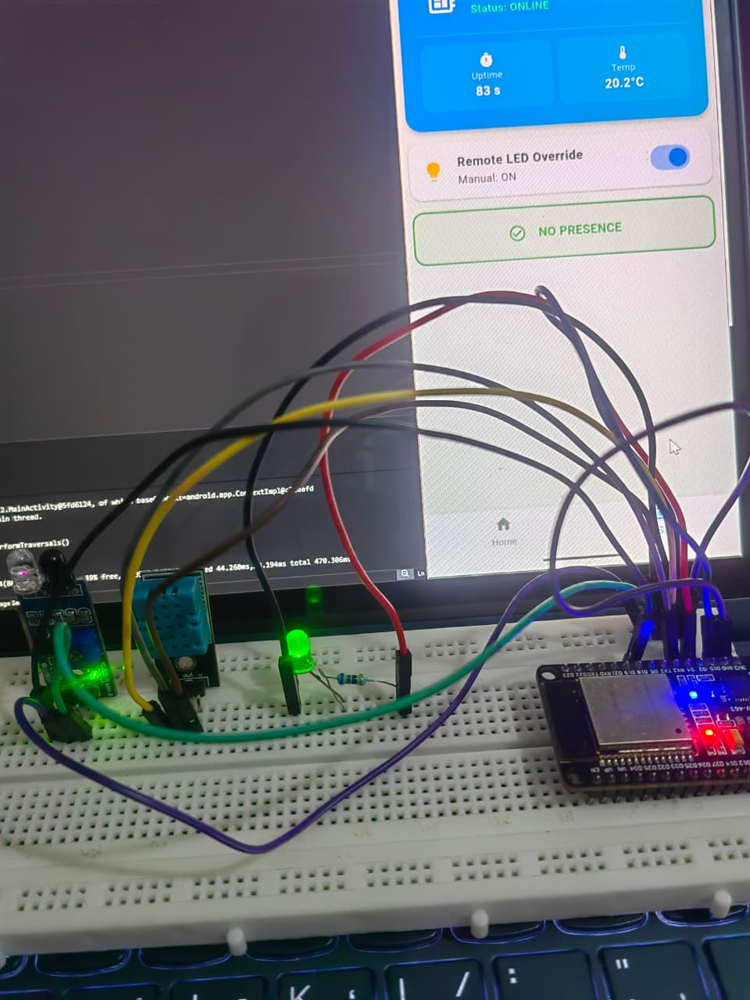
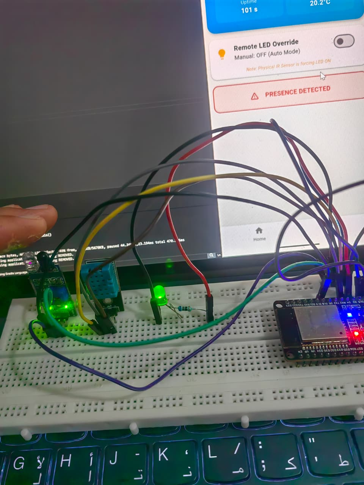

# 🚀 Day 12: Bi-Directional Cloud Control & Stream Optimization

## 📌 Progress Overview
Today focused on achieving **Remote Actuation**. I moved beyond just reading sensor data to sending commands from a Flutter app to the ESP32 via the Cloud. This required a deep dive into asynchronous streaming and JSON parsing on embedded systems.

## 🏗️ The "Command & Control" Logic
The system now handles two-way traffic:
1. **App to Cloud:** Flutter writes a `led_manual` boolean to the Realtime Database.
2. **Cloud to ESP32:** The ESP32 maintains a persistent SSL stream. When a change is detected, it triggers a callback function to update the physical LED state.

## 🛠️ Key Technical Challenges
### 1. The "Partial vs. Full Update" Bug
* **Issue:** The ESP32 would sometimes miss updates if the data was sent as part of a larger JSON object rather than a single key update.
* **Solution:** Implemented a robust `streamCallback` that checks both the `dataPath()` (for specific changes) and decodes the `jsonObject()` (for full updates).

### 2. SSL/TLS Engine Collisions
* **Issue:** Using a single `FirebaseData` object for both Pushing (Loop) and Streaming (Callback) caused SSL handshake failures.
* **Solution:** Created two separate instances: `fbdo` for outbound data and `streamData` for the inbound listener.

## Screenshot

