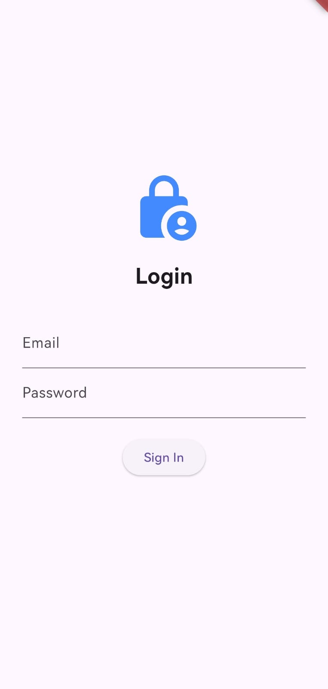
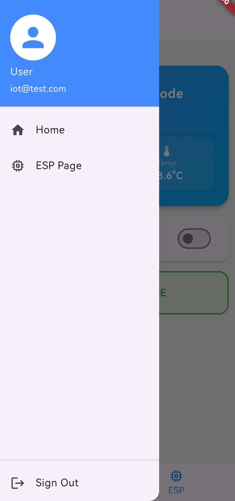

# 🚀 DAY 13 IoT & Flutter Challenge: Secure Cloud Node

A professional-grade IoT ecosystem featuring an **ESP32** microcontroller and a **Flutter** mobile application. This project demonstrates real-time sensor monitoring, remote hardware actuation, and secure user authentication via **Google Firebase**.

---

## 🏗️ System Architecture
The project utilizes a **Tri-Pillar Architecture**:
1. **The Edge (ESP32):** Reads environmental data (DHT11, IR) and listens for remote commands using persistent SSL streams.
2. **The Cloud (Firebase):** Acts as the real-time bridge for data synchronization and handles secure user identity management.
3. **The Controller (Flutter):** A cross-platform mobile app that provides a reactive dashboard and administrative controls.

---

## 🛠️ Tech Stack
* **Microcontroller:** ESP32 (DevKit V1)
* **Sensors/Actuators:** DHT11 (Temp/Humidity), IR Obstacle Sensor, SG90 Servo, 5mm LED.
* **Backend:** Firebase Realtime Database (RTDB) & Firebase Authentication.
* **Mobile:** Flutter (Dart) with `firebase_auth` and `firebase_database`.

---

## 📸 Project Gallery

 

---