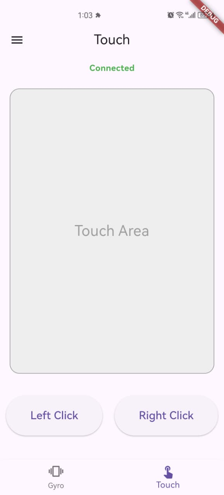
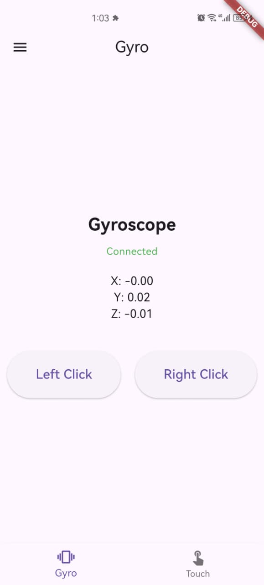
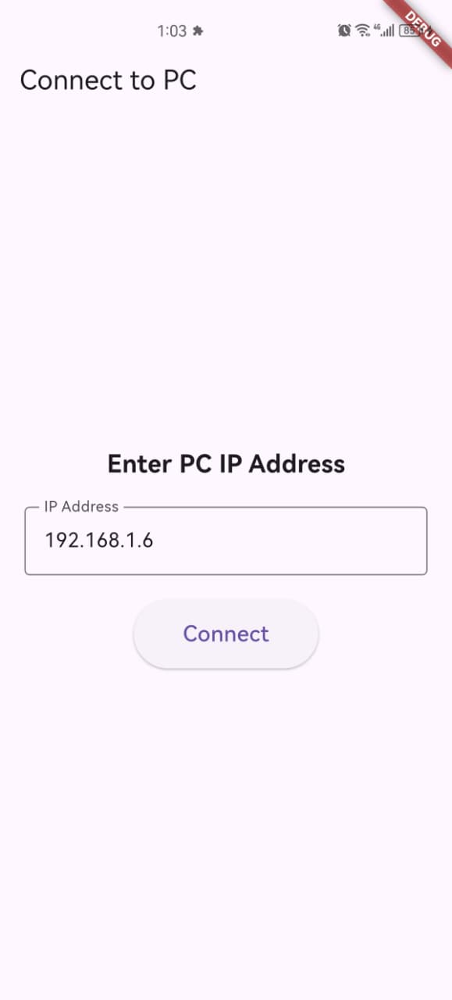

# Project Documentation: Gyroscope & Touch Mouse Controller

This project consists of a **Flutter mobile application** acting as a client and a **Python script** acting as a server. The mobile app sends sensor (gyroscope) and touch data to the PC via WebSockets, which the Python script uses to control the mouse cursor.

---

## 1. Python Controller (`python_controller.py`)

The core logic for mouse movement resides here. It uses a physics-based approach to ensure smooth, human-like movement.

### Key Concepts & Formulas

#### A. Momentum (Smoothing)
Instead of moving the mouse instantly based on the sensor value (which looks jittery and robotic), we use a **momentum** system. This simulates a physical object with weight.

**Formula:**
$$v_{current} = (v_{current} \times m) + (v_{target} \times (1 - m))$$

*   $v_{current}$: The current velocity of the mouse.
*   $v_{target}$: The desired velocity based on the latest gyroscope reading.
*   $m$ (**Momentum Factor**): A value between 0.0 and 1.0 (set to `0.70`).
    *   Higher $m$ (e.g., 0.9) = More "slide", takes longer to stop/start.
    *   Lower $m$ (e.g., 0.1) = Snappy, instant response.

**Code Implementation:**
```python
self.current_vx = (self.current_vx * self.momentum) + (self.target_vx * (1 - self.momentum))
```

#### B. Deadzone
Sensors always have a bit of noise (jitter) even when the phone is still. The deadzone ignores values below a certain threshold to prevent the cursor from drifting.

**Logic:**
If the absolute value of the sensor reading is less than `DEADZONE` (0.25), treat it as 0.

**Code Implementation:**
```python
if abs(gx) < self.deadzone: gx = 0
if abs(gy) < self.deadzone: gy = 0
```

#### C. Sensitivity & Velocity Calculation
The raw gyroscope values (radians/second) are too small to move the mouse across a 1080p+ screen efficiently. We multiply them by a sensitivity factor.

**Formula:**
$$Velocity = SensorValue \times Sensitivity \times ScalingFactor$$

*   **Sensitivity**: User-configurable speed (set to `230`).
*   **Scaling Factor**: A constant (`0.2`) to normalize the speed for the 100Hz update loop.

**Code Implementation:**
```python
speed_multiplier = self.sensitivity * 0.2
self.target_vx = -gy * speed_multiplier  # Inverted/Mapped axis
self.target_vy = gx * speed_multiplier   # Mapped axis
```

#### D. High-Frequency Update Loop
The `movement_loop` runs independently of the network data. It runs every **10ms (100Hz)**. This ensures that even if network packets arrive irregularly, the mouse movement remains smooth because the velocity is interpolated over time.

---

## 2. Flutter Application

### A. Connection (`connect_page.dart`)
*   Allows the user to input the PC's IP address.
*   Passes this IP to the subsequent pages so they know where to connect.

### B. Gyroscope Control (`gyropage.dart`)
*   **Sensors Plus**: Uses the `sensors_plus` package to listen to the phone's gyroscope.
*   **Throttling**: Sends data every ~20ms (50Hz) instead of every single sensor event. This prevents flooding the network and reducing lag.
*   **Data Packet**:
    ```json
    {
      "gx": 0.123,
      "gy": -0.45,
      "gz": 0.0
    }
    ```

### C. Touch Control (`touchpage.dart`)
*   **GestureDetector**: Captures `onPanUpdate` events (finger sliding on screen).
*   **Delta Movement**: Sends the difference (`dx`, `dy`) in pixels from the last frame.
*   **Data Packet**:
    ```json
    {
      "action": "move",
      "dx": 5.0,
      "dy": -2.0
    }
    ```

### D. Clicking
Both pages support Left and Right clicks.
*   **Data Packet**:
    ```json
    {
      "action": "click",
      "button": "left" // or "right"
    }
    ```

---

## 3. Coordinate System Mapping

Mobile sensors and PC screens use different coordinate systems.

*   **Mobile Gyro X**: Tilting phone Forward/Backward.
*   **Mobile Gyro Y**: Tilting phone Left/Right.
*   **PC Mouse X**: Horizontal movement.
*   **PC Mouse Y**: Vertical movement.

**Mapping used in Python:**
*   **Mouse X** is controlled by **Gyro Y** (Tilting Left/Right).
*   **Mouse Y** is controlled by **Gyro X** (Tilting Forward/Backward).

*Note: Negative signs are used to invert the direction where necessary to feel natural.*


---

## 4. Screenshot




---