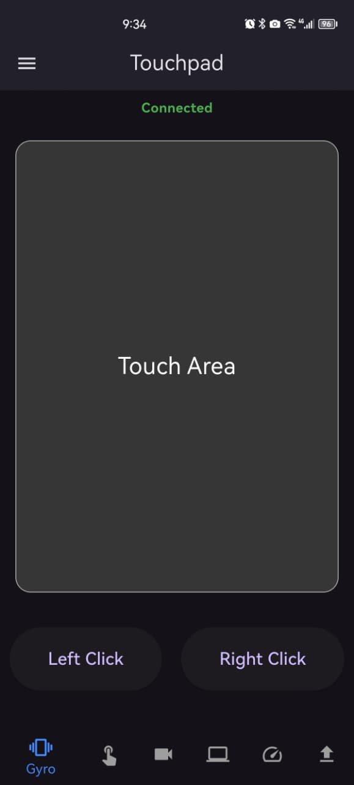
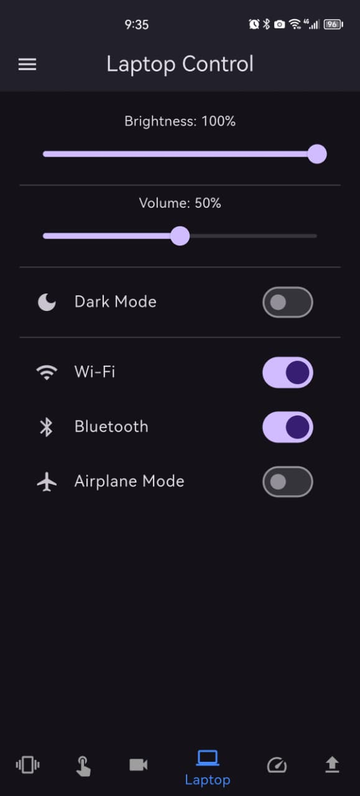
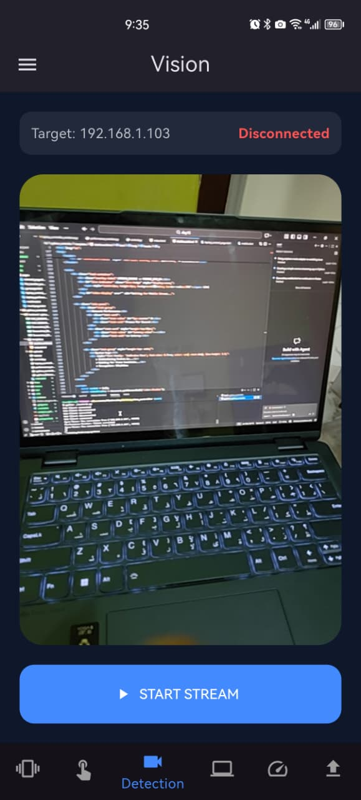
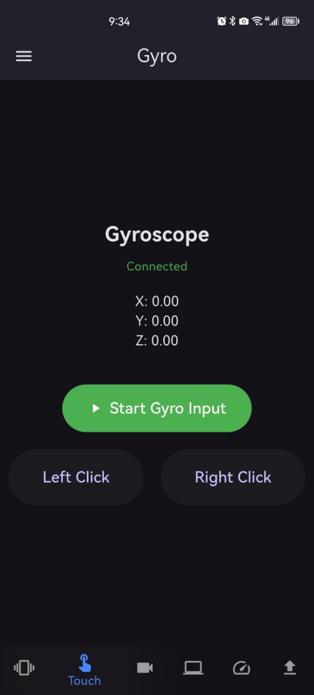
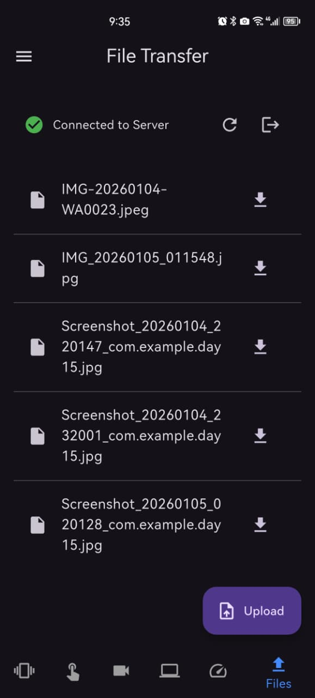
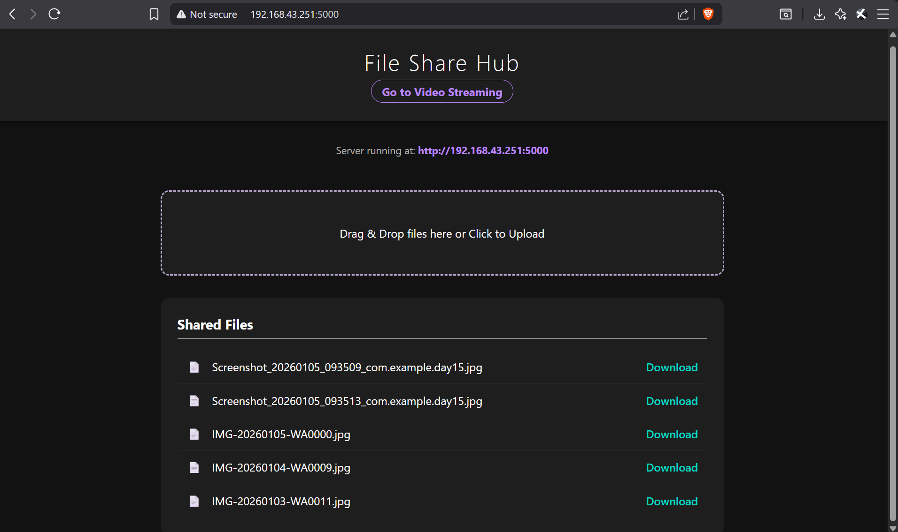
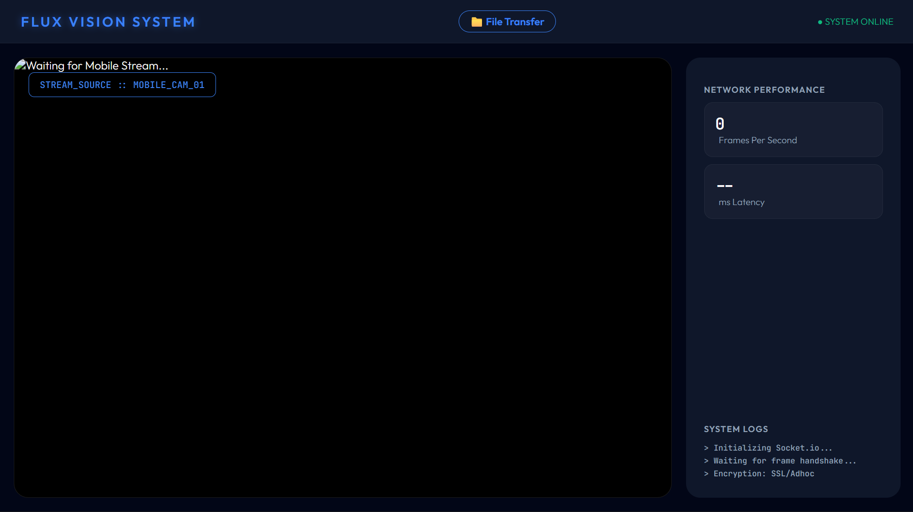

# Flux Vision System 🚀
### Day 15/15: The Final Evolution of Remote Computer Control

Flux Vision is a unified remote management suite that transforms a mobile device into a powerful extension of a laptop. Built over a 15-day sprint, it combines real-time sensor data, low-level system hooks, and live video streaming into a single ecosystem.

---

## 🌟 Key Features

### 1. Unified Control Center (`control.py`)
A consolidated Python backend that manages four distinct services simultaneously:
* **Vision Stream:** High-speed JPEG relay from mobile camera to a Web Dashboard.
* **Hardware Controller:** Safe system toggles for Wi-Fi, Bluetooth, Volume, and Brightness using Windows Radio Management APIs.
* **Air Mouse & Touchpad:** Gyroscope-based "Air Mouse" with physics-based smoothing and a traditional multi-touch gesture pad.
* **Performance Monitor:** Real-time telemetry for CPU, RAM, and Battery via WebSockets.
* **File Share Hub:** Bi-directional file transfer between mobile and desktop.

### 2. Flux Mobile App (Flutter)
* **Dynamic Discovery:** Connection screen to handle local IP addressing.
* **Sensors Integration:** Uses `sensors_plus` for low-latency gyroscope data.
* **Socket.io Integration:** High-speed frame transmission for the "Vision" mode.

---

## 🛠️ Technical Stack

| Component | Technology |
| :--- | :--- |
| **Mobile Frontend** | Flutter, Dart, `sensors_plus`, `socket_io_client` |
| **Backend Server** | Python 3.14, Flask, Flask-SocketIO |
| **Input Emulation** | `pynput` |
| **Hardware Hooks** | `pycaw`, `screen_brightness_control`, `comtypes` |
| **System APIs** | Windows `netsh`, `RadioManagement` (PowerShell) |
| **Communication** | WebSockets (High-frequency data), HTTP (File transfer) |

---

## 📐 Architecture

The system operates on a **Single-Process/Multi-Threaded** model:
1.  **Thread 1 (Flask):** Serves the HTML Dashboards and handles File I/O.
2.  **Thread 2 (Socket.io):** Manages the high-speed Video Relay.
3.  **Thread 3 (Asyncio/Websockets):** Handles the 100Hz Gyroscope data and Performance telemetry.

---

## Screenshot

---
## The Video for this is inside day15_screenshot folder