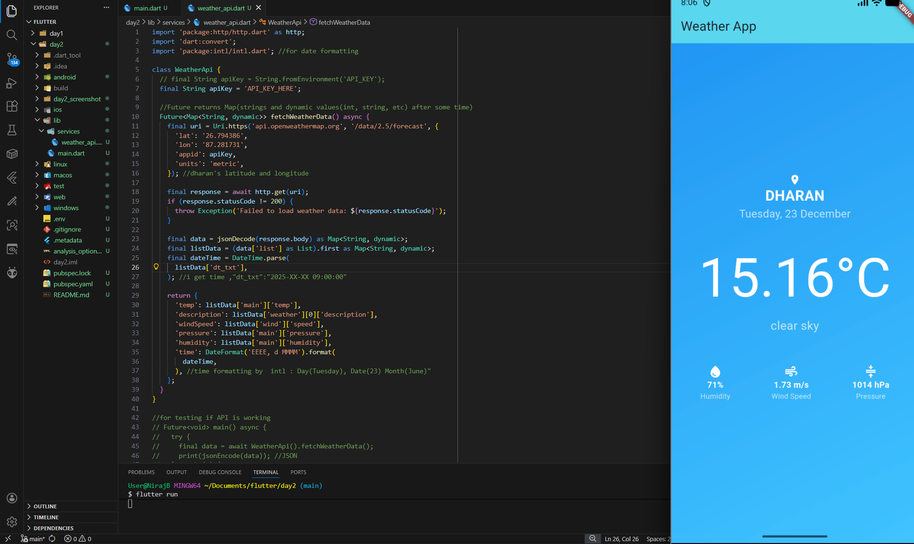
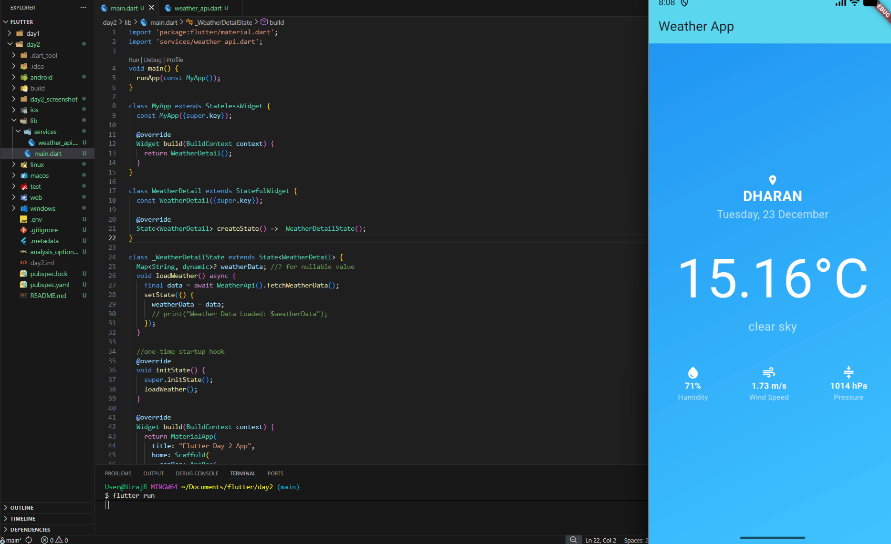

# 🌤️ Day 2 – Flutter Weather App  
### 15 Days Learning Challenge: Flutter App Development

Yesterday was about Flutter basics; **Day 2 was about making the app “smart.”**  
Today, I learned how to connect a Flutter app to the real world using **REST APIs** and display live data in a clean UI.

---

## 📌 What I Built
A **real-time Weather App** that fetches and displays the current weather of **Dharan, Nepal** using the **OpenWeatherMap API**.

The app shows:
- 🌡️ Temperature  
- 💧 Humidity  
- 🌬️ Wind Speed  
- ⚖️ Pressure  
- 🕒 Date & Day (formatted)

---

## 🚀 Today’s Highlights

### 1️⃣ API Integration
- Successfully connected the app to the **OpenWeatherMap API**
- Used **geo-coordinates** instead of city name:
  - 📍 Latitude: `26.79`
  - 📍 Longitude: `87.28`

---

### 2️⃣ Fetching Live Data
- Used the `http` package to make GET requests
- Parsed real-time weather data directly from the API

---

### 3️⃣ Async & Futures
- Learned **async / await**
- Used `Future<Map<String, dynamic>>` to handle network calls
- Kept UI responsive while data loads

---

### 4️⃣ JSON Parsing
- Extracted deeply nested JSON values like:
  - Temperature
  - Weather description
  - Wind speed
  - Humidity
  - Pressure
- Converted raw API data into usable Dart maps

---

### 5️⃣ Lifecycle Management
- Used `initState()` to load weather data **automatically when the screen opens**
- Ensured one-time API call on widget creation

---

### 6️⃣ UI & Icons
- Used Flutter **Icons** for better visualization:
  - 💧 Humidity
  - 🌬️ Wind Speed
  - ⚖️ Pressure
- Clean, minimal UI focused on readability

---

## 🛠️ Tech Stack
- **Flutter**
- **Dart**
- **HTTP package**
- **OpenWeatherMap API**
- **Intl package** (for date formatting)

---

## 📸 Screenshots

### Code Structure

### App UI

---

## 📂 Project Structure
