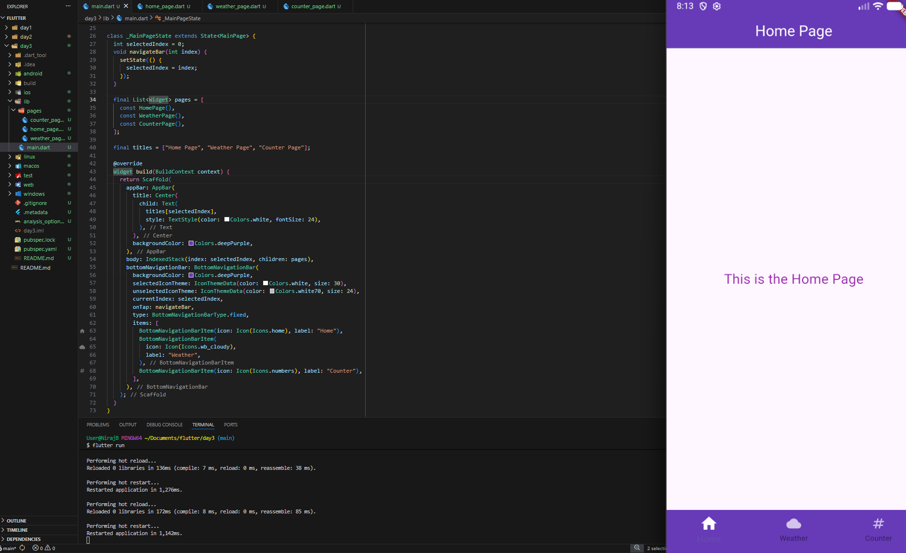
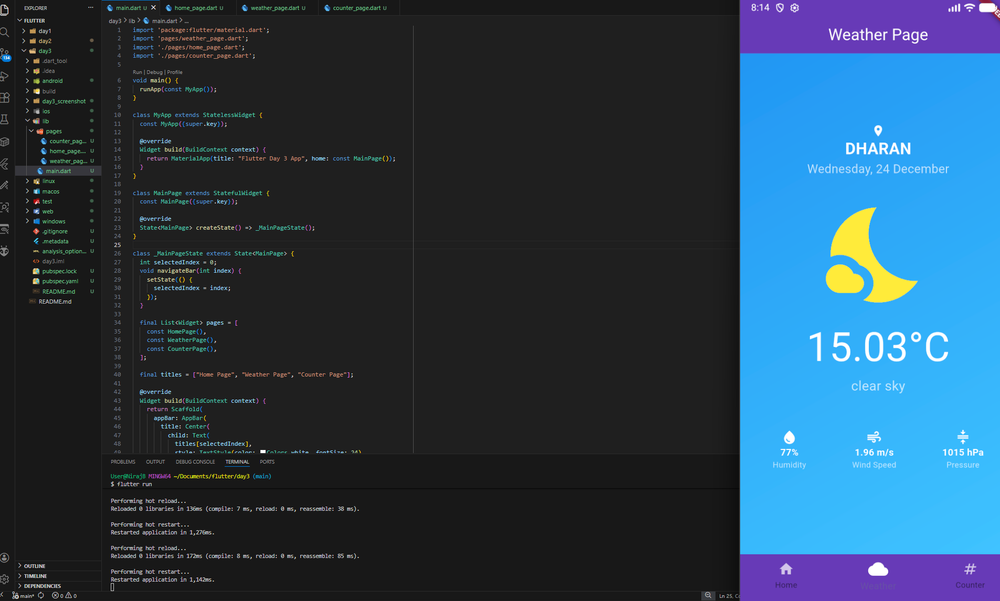
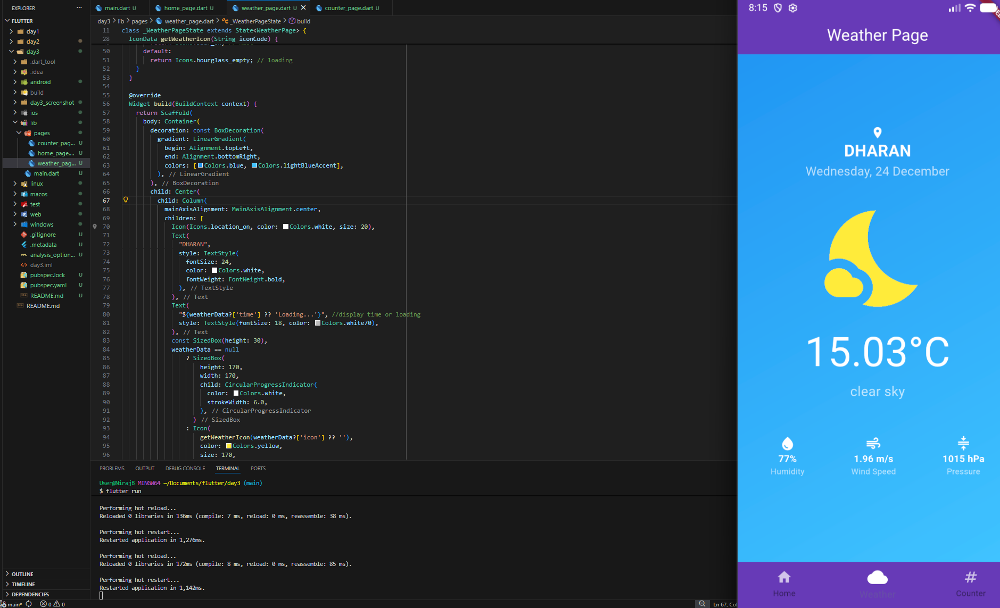
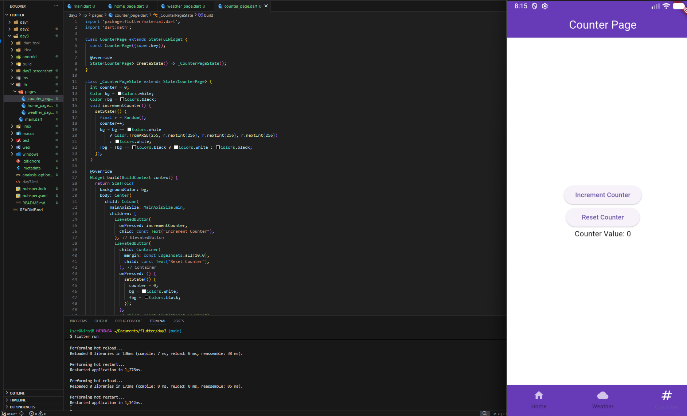

# 🧭 Day 3 – App Navigation & Architecture  
### 15 Days Learning Challenge: Flutter App Development

Three days in, and this Flutter project has officially grown from a **single-page experiment** into a **multi-screen application with proper architecture**.  
Day 3 was all about **navigation, routing logic, and app structure**—the foundation of scalable Flutter apps.

---

## 📌 What I Built
A **multi-module Flutter app** with a **central navigation hub**, combining previous days’ work into one cohesive application.

### Modules Included:
- 🏠 Home
- 🌤️ Weather Dashboard (Day 2)
- 🔢 Counter App (Day 1)

---

## 🚀 Today’s Milestone

### 1️⃣ Central Navigation Hub
- Implemented a **BottomNavigationBar**
- Seamless switching between:
  - Home
  - Weather
  - Counter
- No screen reloads or state loss

---

### 2️⃣ Routing & Navigation Logic
- Explored:
  - `Navigator.push`
  - `Navigator.pushNamed`
- Understood how Flutter manages the **Widget Tree**
- Learned how to keep screens **alive in the background** using:
  - `List<Widget>`
  - `IndexedStack`

🧠 This helped preserve state while switching tabs.

---

### 3️⃣ Project Merger (Big Win 🎉)
- Successfully merged:
  - **Day 1:** Logic & State Management (Counter App)
  - **Day 2:** API & Networking (Weather App)
- Refactored everything into a **single scalable architecture**

➡️ The app now feels like a **real product**, not just isolated demos.

---

### 4️⃣ UI Polish & Visual Improvements
- Enhanced Weather Dashboard UI
- Added **Material Icons** for:
  - Temperature
  - Humidity
  - Wind Speed
  - Pressure
- Improved readability and data scannability

---
## 📸Screenshot

---

## 🛠️ Technical Takeaways
- Navigation is **not just screen switching**
- Good routing ensures:
  - State preservation
  - Smooth UX
  - Scalability as features grow
- Architecture matters early—even for small apps

---
