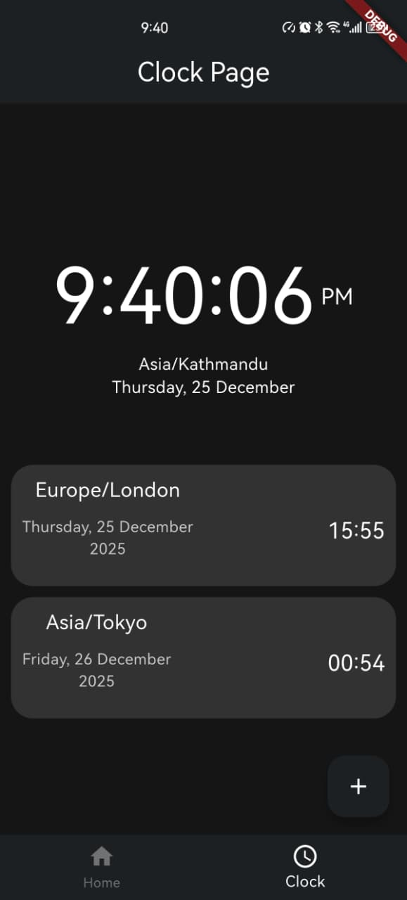

# 🌍 Flutter Learning Challenge

## Day 4 of 15 – World Clock App (Real-Time & Interactive UI)

Day 4 was all about making **time work in real-time**. I built a **World Clock App** that continuously updates and stays interactive, combining live API data with the local system clock for efficiency and smooth UI updates.

---

## 📌 What I Built

A **World Clock App** that:
- Displays current time for multiple global cities
- Updates every second in real time
- Allows users to switch time zones dynamically
- Remains responsive across different screen sizes

---

## 🧠 What I Learned

### ⏱️ Real-Time Updates
- Used `Timer.periodic` to update the clock **every second**
- Ensured smooth UI updates without performance issues

### 🌐 Global Time Integration
- Integrated a **Time API** to fetch accurate time data for cities like:
  - London
  - Tokyo
  - Other global locations
- Combined API data with `DateTime` (system clock) to keep the UI ticking **without spamming API requests**

### 🎛️ User Interaction
- Implemented a `SimpleDialog` picker
- Allowed users to **select different time zones on the fly**

### 📱 Responsive Design
- Used `MediaQuery` to make Clock Cards adaptive
- Ensured consistent UI across various screen sizes and orientations

### 🏗️ App Architecture
- Separated **services (API & logic)** from **UI**
- Improved code readability and scalability
- Followed clean architecture practices for real-world Flutter apps

---

## 🛠️ Tools & Technologies

- Flutter
- Dart
- REST Time API
- Android Emulator
- Visual Studio Code

---

# 📸 Screenshot

