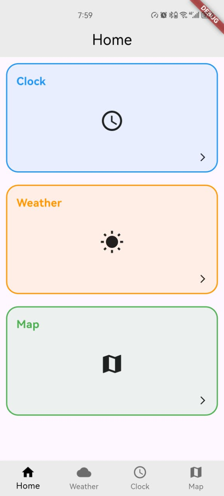

# 🌍 Flutter Learning Challenge

## Day 5 of 15 – Geospatial & Advanced App Architecture

Day 5 focused on **connecting Flutter apps to the real world** using maps, live location data, and scalable app architecture. This day was all about context, geospatial awareness, and inter-widget communication.

---

## 📌 What I Built

A **multi-page Flutter application** that:
- Displays an interactive OpenStreetMap
- Fetches the user’s real-time GPS location
- Automatically centers the map on the current position
- Shares location data across different pages
- Uses clean navigation and modular architecture

---

## 🧠 What I Learned

### 🗺️ Mapping Ecosystem
- Integrated `flutter_map` with **OpenStreetMap**
- Used:
  - `TileLayer` for rendering map tiles
  - `MarkerLayer` to place custom pins on coordinates
- Learned about open-source tile usage and limitations

---

### 📍 Live Location Integration
- Used the `geolocator` package to:
  - Check if location services are enabled
  - Request runtime permissions
  - Fetch real-time latitude and longitude
- Enabled accurate device-based positioning

---

### 🎯 Programmatic Map Control
- Used `MapController` to:
  - Move the camera programmatically
  - Zoom into the user’s current location automatically
- Improved user experience with logic-driven map behavior

---

### 🏗️ State Management (Lifting State Up)
- Lifted shared state from child widgets to the parent
- Enabled multiple widgets (Map & Dashboard) to:
  - Access the same location data
  - Stay synchronized
- Improved scalability and maintainability

---

### 🔁 Callbacks & Widget Communication
- Used **callback functions** to pass data from child widgets to parent widgets
- Enabled clean, controlled data flow between components

---

### 🖱️ Interactivity
- Combined `GestureDetector` with UI components
- Triggered external actions like:
  - Opening URLs
  - Launching other apps using `url_launcher`

---

### 📌 Dart Static Scope
- Learned how `static` variables and methods:
  - Belong to the class rather than an instance
  - Are ideal for constants and utility helpers
- Improved code organization and reuse

---

## 🛠️ Tools & Technologies

- Flutter
- Dart
- flutter_map
- OpenStreetMap (OSM)
- geolocator
- url_launcher
- Android Emulator
- Visual Studio Code

---

## 📸 Screenshots

  

---

✅ **Day 5 Complete**  
This day strengthened my understanding of **real-world Flutter applications**, especially those involving **maps, live location, and clean architecture**.

➡️ Moving on to **Day 6** 🚀
