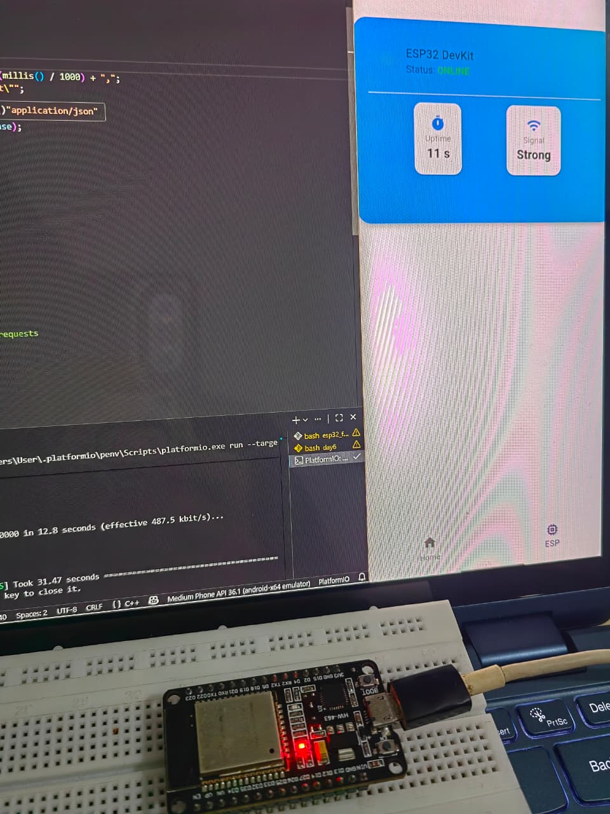
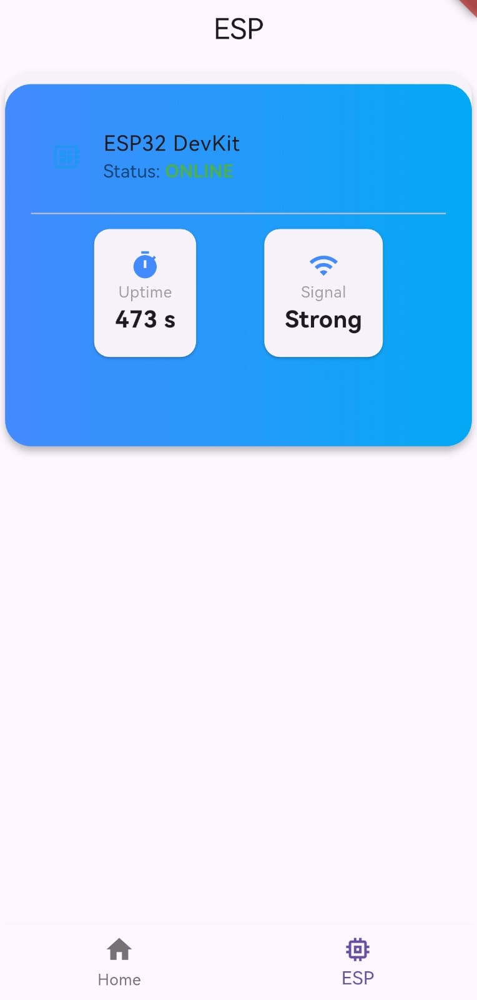

# 🤝🔌 Flutter Learning Challenge

## Day 6 of 15 – The Hardware Handshake (Flutter × ESP32)

Day 6 marked a **major milestone** in my Flutter learning journey — my app officially started **communicating with real hardware**.  
This day was all about **bridging mobile software with embedded systems**, kicking off **Milestone 2** of the challenge.

---

## 📌 What I Built

A **Flutter + ESP32 system** where:
- The ESP32 connects to Wi-Fi as a station
- A local REST API runs directly on the microcontroller
- A Flutter app fetches live data from the ESP32
- Hardware data is displayed cleanly using custom UI components

---

## 🧠 What I Learned

### 🛠️ Professional Firmware Development
- Switched from Arduino IDE to **PlatformIO**
- Learned:
  - Project-based firmware structure
  - Dependency management
  - Cleaner and scalable embedded development workflows

---

### 📡 ESP32 as a Wi-Fi Station
- Used the `WiFi.h` library to:
  - Connect ESP32 to a home Wi-Fi network
  - Obtain a **local IP address**
- Enabled communication within the same network (LAN)

---

### 🌐 Local REST API on ESP32
- Built a **lightweight HTTP server** directly on the ESP32
- Served real-time data via REST endpoints
- Allowed any device on the network (browser or app) to access ESP32 data

---

### 📱 Flutter ↔ ESP32 Communication
- Used Flutter’s `http` package to:
  - Send **GET requests** to the ESP32’s local IP
  - Fetch live hardware data
- Displayed responses using a **custom Card widget**
- Successfully closed the loop between hardware and mobile UI

---

### 🧩 System-Level Thinking
- Understood how:
  - Hardware
  - Networking
  - APIs
  - Mobile UI  
  work together as one system

---

## 🛠️ Tools & Technologies

### Mobile
- Flutter
- Dart
- HTTP package
- Android Emulator

### Hardware
- ESP32
- PlatformIO
- Arduino Framework
- WiFi.h

### Networking
- Local REST API
- HTTP GET Requests
- LAN Communication

---

## 📸 Screenshots

  

---

## 🚀 Milestone Update

✅ **Milestone 2 Started**  
Flutter is no longer just an app — it’s now a **controller, monitor, and interface for real hardware**.

➡️ On to **Day 7**: deeper hardware interaction & real-time control 🔥
