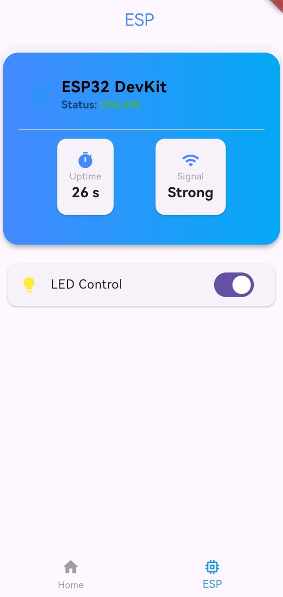
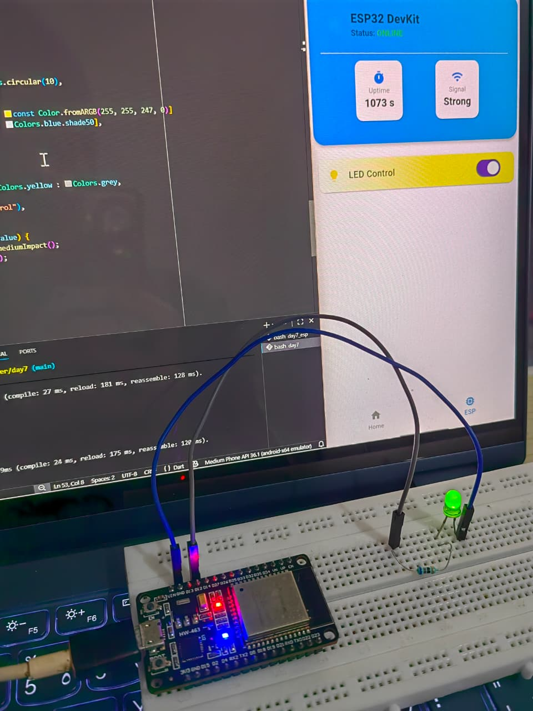

# 🔌 Flutter Learning Challenge

## Day 7 of 15 – Bridging the Digital & Physical Worlds 💡📲

Day 7 marked the **magic moment** of my Flutter journey. This is where my app stopped being just a viewer and became a **real controller**. I successfully enabled **two-way communication** between my Flutter app and an ESP32, allowing real-world hardware to respond instantly to mobile UI interactions.

---

## 🚀 What I Built

An **IoT Control Dashboard** that:
- Controls a physical LED on an ESP32 from a Flutter app
- Displays real-time device connectivity status
- Provides haptic feedback for every hardware interaction
- Supports color selection for future RGB LED expansion

---

## 🧠 What I Learned

### 🔁 Two-Way Communication
- Implemented **HTTP-based communication**
- Flutter sends commands to ESP32
- ESP32 responds with live status updates
- Achieved **near-zero latency control**

---

### 💡 Remote Hardware Control
- Controlled a physical LED using a Flutter toggle switch
- ESP32 processes commands via a local REST API
- Device reacts instantly to UI interactions

---

### 📳 Haptic Feedback
- Integrated Flutter’s **HapticFeedback**
- Each toggle interaction triggers a subtle vibration
- Improved the realism and tactile feel of the app

---

### 📡 Live Connectivity Monitoring
- App displays **ONLINE / OFFLINE** status
- Status updates automatically if:
  - ESP32 loses power
  - Wi-Fi disconnects
- Visual indicator changes color dynamically

---

### 🎨 Color Picker Integration
- Added a professional **Color Picker module**
- Prepared the system for:
  - RGB LEDs
  - Smart lighting
  - Future home automation features

---

## 🏗️ Architecture Overview

### Flutter App
- Modular page structure
- REST-based communication layer
- Stateful UI synced with hardware status
- Clean separation of UI and logic

### ESP32 Firmware
- PlatformIO-based project
- ESP32 running in **Wi-Fi Station Mode**
- Local HTTP server serving JSON responses
- GPIO control for LED switching

---

## 🛠️ Tech Stack

- **Flutter**
- **Dart**
- **ESP32 (Station Mode)**
- **HTTP Protocol**
- **PlatformIO**
- **Android Emulator**
- **Visual Studio Code**

---

## 📸 Screenshots

---

## 🔥 Key Takeaway

This day connected **software to the physical world**. With real-time control, feedback, and monitoring in place, the foundation is set for building **full-scale IoT systems**, smart devices, and automation dashboards.

Halfway done — the real fun has just begun 🚀
