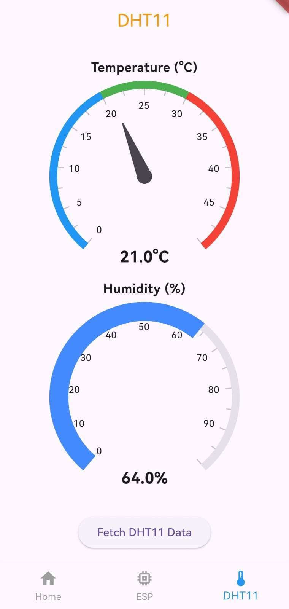

# ⚙️ Flutter Learning Challenge

## Day 8 of 15 – Environmental Monitoring & Real-Time Sync 🌡️🔄

Day 8 was a massive leap into **Visual Data Intelligence**. I transitioned from simple binary controls (ON/OFF) to a fully-featured **Climate Dashboard**. By integrating the **DHT11 sensor**, I learned to fetch, parse, and visualize complex environmental data using professional-grade UI components.

---

## 🚀 What I Built

A **Real-Time Weather Station** that:
- Captures **Temperature** and **Humidity** using a DHT11 sensor.
- Serves data via a **JSON REST API** hosted on the ESP32.
- Displays readings on the Flutter app using **Syncfusion Radial Gauges**.
- Syncs state at 1-second intervals to ensure a "live" needle experience.

---

## 🧠 What I Learned

### 📊 Professional Data Visualization
- Mastered `syncfusion_flutter_gauges` to build high-fidelity meters.
- **Needle Pointers:** Used for precise temperature tracking.
- **Range Pointers:** Used for fluid humidity progress visualization.
- **Annotations:** Learned to center-align live text data inside circular axes.

### 📡 JSON API Architecture
- Programmed the ESP32 to respond with a multi-value JSON object.
- **Snippet (ESP32 JSON Response):**
  ```cpp
  void handleGetStatus() {
    float t = dht.readTemperature();
    float h = dht.readHumidity();
    String json = "{\"temp\":" + String(t) + ",\"hum\":" + String(h) + "}";
    server.send(200, "application/json", json);
  }
---

# Screenshot

