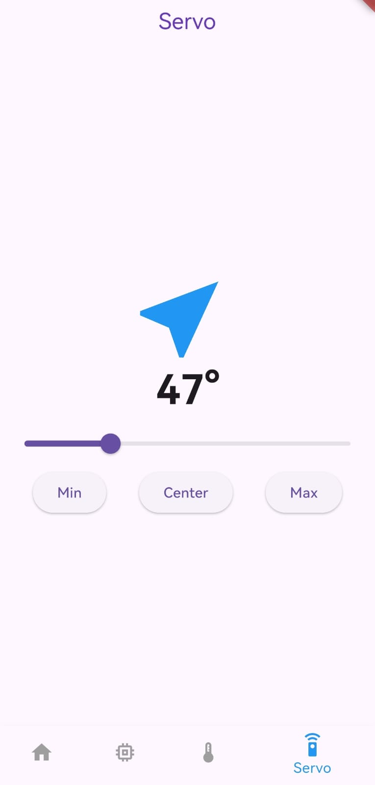
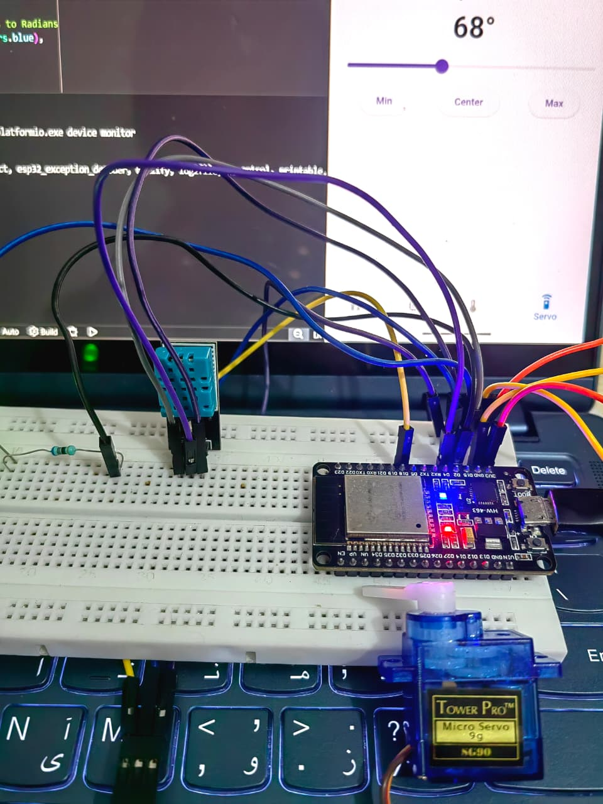

# ⚙️ Flutter Learning Challenge

## Day 9 of 15 – Interactive Actuation & Physical Control 🦾📈

Day 9 marked the transition from **passive data monitoring** to **active physical control**. I successfully integrated a **Servo Motor** into the ecosystem, allowing the Flutter app to send mechanical commands to the ESP32. This provides the "muscle" needed for future automation features.

---

## 🚀 What I Built

A **Smart Actuator Interface** that:
- Controls a **Servo Motor** angle (0° to 180°) using a custom Flutter slider.
- Visualizes real-time **Temperature & Humidity** trends via the DHT11 sensor.
- Uses **Time-Series Charts** to track environmental history alongside manual motor adjustments.
- Implemented a "Manual Override" dashboard to test hardware limits and mechanical response.

---

## 🧠 What I Learned

### 🦾 Servo Fundamentals & PWM
- Understanding the **SG90 Servo**: Learned how it requires a 50Hz signal to translate pulse widths into physical degrees.
- **Hardware Integration:** Used the `ESP32Servo` library to manage PWM (Pulse Width Modulation) timers without interfering with the Wi-Fi stack.
- **Power Management:** Identified that servos are "noisy" components; learned the importance of common ground (GND) when using external power.

### 🌐 The Command Pipeline
- Created a specialized **REST API endpoint** on the ESP32 (`/servo?angle=X`) to handle integer parameters.
- Built a Flutter service to send network requests that translate slider values into hardware-level movement.

### 📉 Time-Series Data Stream
- Learned to manage a rolling `List<ChartData>` in Dart to store the last 20 DHT11 readings.
- Integrated `syncfusion_flutter_charts` to display smooth, real-time line graphs.

---

## 🏗️ Technical Implementation

### 📱 Flutter: Manual Control Logic
The slider maps its value directly to a network call, enabling remote mechanical movement.

```dart
Slider(
  value: _servoPos,
  min: 0,
  max: 180,
  divisions: 180,
  label: _servoPos.round().toString(),
  onChanged: (value) {
    setState(() => _servoPos = value);
    // Send to ESP32: [http://192.168.1.](http://192.168.1.)XX/servo?angle=90
    _sendServoCommand(value.toInt());
  },
)
```

---

## 🔌 ESP32: Actuation Logic
The firmware listens for the angle parameter and updates the PWM pulse accordingly.

```cpp
void handleServo() {
  if (server.hasArg("angle")) {
    int angle = server.arg("angle").toInt();
    myServo.write(angle); // Sets the PWM pulse width
    server.send(200, "text/plain", "Angle set to " + String(angle));
  }
}
```

## 🛠️ Tech Stack

- Framework: Flutter (Dart)
- Hardware: ESP32 & SG90 Servo
- Sensor: DHT11 (Digital Temp/Hum)
- Charts: Syncfusion Flutter Charts
- Communication: HTTP / REST / PWM

## 📸Screenshot


